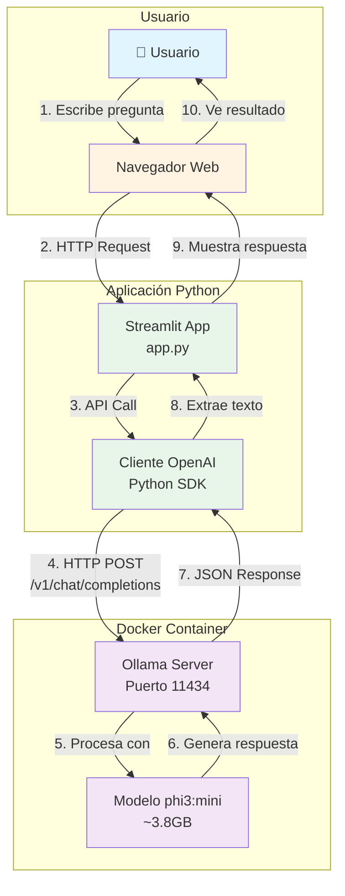

# 🏗️ Arquitectura del Proyecto

## Diagrama de Arquitectura



## 📊 Flujo de Datos

```
┌─────────────┐
│   Usuario   │
│  (Navegador)│
└──────┬──────┘
       │ 1. Escribe pregunta
       ▼
┌─────────────────────┐
│   Streamlit App     │
│   (app.py)          │
│   Puerto: 8501      │
└──────┬──────────────┘
       │ 2. Crea mensaje
       ▼
┌─────────────────────┐
│  Cliente OpenAI     │
│  (Python SDK)       │
└──────┬──────────────┘
       │ 3. HTTP POST
       │    /v1/chat/completions
       ▼
┌─────────────────────┐
│   Ollama Server     │
│   (Docker)          │
│   Puerto: 11434     │
└──────┬──────────────┘
       │ 4. Procesa con modelo
       ▼
┌─────────────────────┐
│   phi3:mini         │
│   (Modelo de IA)    │
│   ~3.8GB            │
└──────┬──────────────┘
       │ 5. Genera respuesta
       │
       │ (flujo inverso)
       │
       ▼
┌─────────────┐
│   Usuario   │
│  Ve respuesta│
└─────────────┘
```

## 🔌 Componentes Principales

### 1. **Frontend (Streamlit)**
- **Archivo:** `app.py`
- **Puerto:** 8501
- **Función:** Interfaz web simple para el usuario
- **Tecnología:** Streamlit (Python)

### 2. **Cliente API**
- **Librería:** `openai` (Python SDK)
- **Función:** Comunicación con Ollama usando API compatible con OpenAI
- **Endpoint:** `http://localhost:11434/v1`

### 3. **Servidor de Modelos (Ollama)**
- **Contenedor:** Docker (`ollama/ollama`)
- **Puerto:** 11434
- **Función:** Servidor que ejecuta modelos de IA localmente
- **API:** Compatible con OpenAI API

### 4. **Modelo de IA**
- **Nombre:** `phi3:mini`
- **Tamaño:** ~3.8GB
- **Función:** Genera respuestas de texto basadas en preguntas
- **Ubicación:** Dentro del contenedor Docker

## 📡 Protocolos y Puertos

| Componente | Puerto | Protocolo | Descripción |
|------------|--------|-----------|-------------|
| Streamlit | 8501 | HTTP | Interfaz web |
| Ollama | 11434 | HTTP/REST | API de modelos |

## 🔄 Flujo Completo Paso a Paso

1. **Usuario escribe pregunta** en el navegador (Streamlit UI)
2. **Streamlit captura** la pregunta del input
3. **Cliente OpenAI** crea una petición HTTP POST a Ollama
4. **Ollama recibe** la petición y la procesa con el modelo
5. **Modelo phi3:mini** genera una respuesta
6. **Ollama devuelve** la respuesta en formato JSON
7. **Cliente OpenAI** extrae el texto de la respuesta
8. **Streamlit muestra** la respuesta al usuario en la interfaz

## 🐳 Docker

```
┌─────────────────────────────────┐
│      Docker Container           │
│  ┌───────────────────────────┐  │
│  │    Ollama Server         │  │
│  │    Puerto: 11434         │  │
│  │                          │  │
│  │  ┌────────────────────┐ │  │
│  │  │  Modelo phi3:mini  │ │  │
│  │  │  (~3.8GB)          │ │  │
│  │  └────────────────────┘ │  │
│  └───────────────────────────┘  │
└─────────────────────────────────┘
         ▲
         │ HTTP API
         │
┌────────┴────────┐
│  Python App     │
│  (app.py)       │
└─────────────────┘
```

## 📦 Dependencias

```
app.py
  ├── streamlit (Interfaz web)
  ├── openai (Cliente API)
  └── python-dotenv (Variables de entorno)
        │
        └── .env (Configuración)
              ├── OPENAI_API_KEY
              └── OPENAI_BASE_URL
```

## 🎯 Características Clave

- ✅ **100% Local**: Todo corre en tu computadora
- ✅ **Sin Internet**: No necesita conexión después de descargar
- ✅ **API Compatible**: Usa la misma API que OpenAI
- ✅ **Simple**: Solo 3 componentes principales
- ✅ **Ligero**: Modelo pequeño (~3.8GB)

---

**💡 Nota:** Este diagrama muestra la arquitectura actual del proyecto. Todos los componentes se ejecutan localmente en tu máquina.

